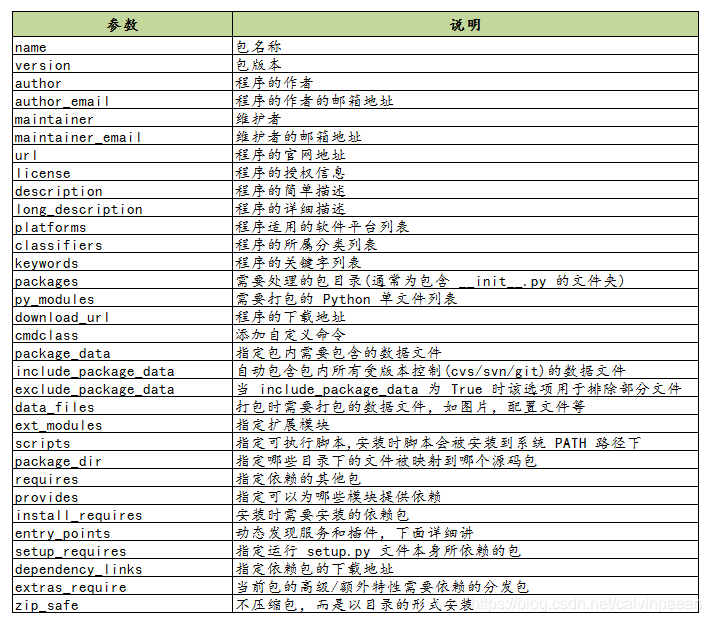

## 目录

- [目录](#目录)
- [cmake 综述](#cmake-综述)
  - [1. 背景](#1-背景)
  - [2. 介绍](#2-介绍)
  - [3. 使用](#3-使用)
  - [CMaKeLists.txt示例](#cmakeliststxt示例)
  - [运行示例](#运行示例)
- [使用库](#使用库)
  - [库文件示例(不带main函数)](#库文件示例不带main函数)
  - [将库文件生成为库](#将库文件生成为库)
  - [1. 在CMaKeLists.txt中添加库的生成命令并编译](#1-在cmakeliststxt中添加库的生成命令并编译)
  - [2. 编写头文件(库需要被引用才能使用)](#2-编写头文件库需要被引用才能使用)
  - [3. 在CMaKeLists.txt中添加可执行程序的生成命令](#3-在cmakeliststxt中添加可执行程序的生成命令)
  - [对于已经存在的库](#对于已经存在的库)
- [setup.py 综述](#setuppy-综述)
  - [1. 背景](#1-背景-1)
  - [2. 介绍](#2-介绍-1)
  - [3. 使用](#3-使用-1)
  - [setup.py示例](#setuppy示例)
- [1. XML(EXtensible Markup Lannguange，可扩展标记语言)综述](#1-xmlextensible-markup-lannguange可扩展标记语言综述)
  - [1. 背景](#1-背景-2)
  - [2. 介绍](#2-介绍-2)
  - [3. 使用](#3-使用-2)
  - [4. XML文件示例](#4-xml文件示例)
- [2. YAML(Yet Another Markup Language 另一种标记语言)综述](#2-yamlyet-another-markup-language-另一种标记语言综述)
  - [1. 背景](#1-背景-3)
  - [2. 介绍](#2-介绍-3)
  - [3. 使用](#3-使用-3)
    - [1. 语法](#1-语法)
    - [2. 支持数据类型](#2-支持数据类型)
  - [4. YAML文件示例](#4-yaml文件示例)


## cmake 综述
### 1. 背景
任意一个C++程序都可以用g++来编译，对于规模较大的工程所需要输入的编译命令将越来越长，此外各个类之间还会有复杂的依赖关系，一部分要编译成可执行文件，一部分要编译成库文件，此时如果仅靠g++命令则需要输入大量的命令，着无疑令人感到繁琐。
### 2. 介绍
对于规模较大的工程我们需要一些工程管理工具，历史上工程师们曾使用makefile进行自动编译，但cmake比它更加方便。
### 3. 使用
CMaKeLists.txt文件用于告诉cmake要对这个目录下的文件做什么事情，CMaKeLists.txt文件的内容要遵循cmake的语法
### CMaKeLists.txt示例
```bash
#声明要求的cmake最低版本
cmake_miinum_required( VERSION 2.8 )

#声明一个cmake工程和可执行文件文件无关
project( Hellocmake )

#添加一个可执行文件
#语法: add_excutable( 程序名  源代码文件 )
add_excutable( hellocmake hellocmake.cpp )
```
### 运行示例
```bash
#在当前目录下对工程进行cmake编译，会输出一些编译信息，然后在当前目录下生成一些中间文件，其中最重要的是MaKeFile
cmake . 
#用make命令对工程进行编译
make
#一切顺利我们就能得到在CMakeLists.txt中声明的那个可执行文件，运行
./hellocmake
#cmake生成一大堆中间文件是我们不需要的，一个个删除又很麻烦，此时把它们放到一个文件夹中
mkdir build
cd build
#cmake ..命令对上一层文件夹进行编译
cmake ..
make
```
## 使用库
在一个C++工程中并不是所有的代码都会编译成可执行文件，只有带有main函数的文件会生成可执行文件，另一些代码我们期望打包成一个东西供其他程序调用。这个东西就是库
### 库文件示例(不带main函数)
```bash 
#include <iostream>
using namespace std;

void printHello() {
    cout << "Hello cmake" << endl;
}
```
### 将库文件生成为库
### 1. 在CMaKeLists.txt中添加库的生成命令并编译
```bash
#结构同前面的添加可执行文件
#生成静态库.a
add_library( hello libHellocamke.cpp)
#生成共享库.so
add_library( hello_shared SHARED libHellocmake.cpp)
```
```
cd build 
cmake ..
make
```
库分为静态库与共享库。区别在于静态库每次被调用都会产生一个副本，而共享库则只有一个副本。
### 2. 编写头文件(库需要被引用才能使用) 
```bash
#ifndef LIBHELLOCMAKE_H_
#define LIBHELLOCMAKE_H_
//上面的宏定义是为了防止重复引用这个头文件而引起的重定义错误

//打印一句Hello的函数
void printHello();

#endif
```
这样我们就能在.cpp文件中引用库了
### 3. 在CMaKeLists.txt中添加可执行程序的生成命令
```bash
add_excutable( useHello useHello.cpp)
target_link_libraries( useHello hello_shared)
```
### 对于已经存在的库
```bash
#在CMakeLists.txt中添加库的目录，此方法需要手动修改路径
include_directories("path_to_libraries")
#如果只有头文件的库则不需要以下的命令将程序链接到库上
target_link_library("name_of_program" "name_of_libraries")
```
## setup.py 综述
### 1. 背景
平常我们习惯了使用 pip 来安装一些第三方模块，这个安装过程之所以简单，是因为模块开发者为我们默默地为我们做了所有繁杂的工作，而这个过程就是打包。
打包，就是将你的源代码进一步封装，并且将所有的项目部署工作都事先安排好，这样使用者拿到后即装即用，不用再操心如何部署的问题(配环境无疑是痛苦的)
### 2. 介绍
在Python开发中，我们经常需要将自己的代码打包成可供其他人使用的库或应用程序。为了方便用户安装和使用，我们需要创建一个配置文件 setup.py，用于定义打包的相关信息和依赖项。
### 3. 使用
setup.py是一个python脚本，因此其要符合python语法
### setup.py示例
```bash
from setuptools import setup, find_packages
from pkg_resources import parse_requirements

with open("requirements.txt", encoding="utf-8") as fp:
    install_requires = [str(requirement) for requirement in parse_requirements(fp)]
 
setup(
    name="my_package",
    version="1.0.0",
    author="Your Name",
    author_email="your_email@example.com",
    description="A short description of your package",
    long_description="eds sdk for python",
    license="Apache License, Version 2.0",
    url="http://test.com",
 
    classifiers=[
        "Programming Language :: Python :: 3",
        "License :: OSI Approved :: MIT License",
        "Operating System :: OS Independent",
    ],
    
    
    include_package_data=True, # 一般不需要
    packages=find_packages(),
    install_requires=install_requires,
    entry_points={
        'console_scripts': [
            'test = test.help:main'
        ]
    }
```

- classifiers: 用于指定所属分类的列表，例如所支持的Python版本、所使用的许可证等
- data_files：（如果没有可以不写）装过程中，需要安装的静态文件，如配置文件、service文件、图片等
- install_requires：（自动安装依赖）install_requires = ["requests"]: 需要安装的依赖包。如果一个一个添加无疑是非常麻烦的，因此我们使用requirements.txt文本文件传输需要安装的依赖包。requirements.txt用于列出 Python 项目所需的所有外部库及其版本。使用 requirements.txt 文件可以方便地记录和管理项目的依赖，确保项目的可复现性和可移植性。
- ​​​​​​packages: （自动搜索 Python 包）包含的模块列表（包含__init__.py的文件夹），这里通常使用 find_packages()，它默认在和setup.py同一目录下搜索各个含有 __init__.py 的包(在python的ROS2包中你会看到一个什么都不含的__init__.py文件)。有些不想要进行打包的文件可以排除
- entry_points： 动态发现服务和插件，可以用来制作命令行工具。也就是我们可以通过一些简单的命令，来运行 Python 项目中的指定文件或是函数。你可以理解为使用程序的入口。
这里只是对setup.py文件最简单的介绍，更详细的内容请自行搜索，对于ROS2这之间最重要的部分是entry_points。
```bash
# 格式为节点名称 = 包名称.包含主程序的python模块文件名：main函数名字(一般为main)
    entry_points={
        'console_scripts': [
            'node_name = package_name.module_name:main_func',
        ]
    }
# 只有设置好程序入口，才能正常使用python语言下的ROS2包
```

## 1. XML(EXtensible Markup Lannguange，可扩展标记语言)综述
### 1. 背景
我们都知道txt文件，这是一个普通的文本文件，里面的内容可以随便写，格式也很随意。如果我们将需要的数据记入txt文件，之后我们再读取里面有对应关系的数据就需要挨个解析，这很麻烦。因此我们需要一种语言方便传输数据，这就是XML。
### 2. 介绍
XML语言全名为EXtensible Markup Lannguange即可扩展标记语言，可作为系统的配置文件或作为一种特殊的数据结构，在网络中进行传输。
### 3. 使用
XML语言要点有两个，一个是XML声明，一个是描写数据的格式，我们将在示例中逐一说明。
### 4. XML文件示例
```bash
# XML声明：指出文档类型，指定XML语言，指定字符编码
<?xml version="1.0" encoding="utf-8" ?>
# XML语言以标签的形式包含数据，通过读取标签解析对应的数据
# 再XML文件中<!--   -->是注释的格式，<>为标签开头，</>为标签结尾，标签之中可以包含标签。
<!--Users是一个根标签，必须只能有一个，而Users里面的子属性可以有多个-->
<!--根标签名字随意取-->
<Users>
    <user id="1">
        <name>张三</name>
        <age>18</age>
        <address>广州</address>
    </user>
    <userAttribute>都是爱学习的人</userAttribute>
    <user id="2">
        <name>李四</name>
        <age>25</age>
        <address>哈尔滨</address>
    </user>

 # 由于XML语法带有一些特殊符号，如果我们要使用这些符号可能会出现冲突，因此我们用特殊字符代替这些符号，自己查查看这些分别代表什么。
 # XML中可以写一个叫CDATA的数据区，里面的内容可以随便写，就不需要使用特殊字符代替了，但是里面的内容会被识别为纯文本，这可能需要额外的处理才能识别具体的信息。
    <!--以下是带有大于号小于号等特殊字符的写法-->
    <special>
        <![CDATA[
        5 > 2 && 3 < 5
    ]]>
    </special>
    <!--特殊字符用法二-->
    <special>  5 &gt; 2 &amp;&amp; 3 &lt; 5 </special>
</Users>
```
在ROS2中一般会有一个package.xml

## 2. YAML(Yet Another Markup Language 另一种标记语言)综述
### 1. 背景
有人会问我们已经有了XML语言为什么还要YAML语言？当一个对象非常复杂的时候我们使用XML语言对其进行描述无疑是非常复杂的，因为我们需要大量的嵌套、标签来描述这个对象。由此发明了YAML语言，它不使用标签并使用缩进来表示层级结构，这使得其方便所有人读写。
### 2. 介绍
XML语言全名为Yet Another Markup Language 即另一种标记语言，其常用于参数配置文件。
### 3. 使用
#### 1. 语法
- 大小写敏感
- 使用缩进表示层级关系
- 禁止使用tab缩进，只能使用空格键
- 缩进的空格数不重要，只要相同层级的元素左对齐即可
- 使用#表示注释
- 字符串可以不用引号标注
####  2. 支持数据类型
- 对象：键值对的集合，又称为映射（mapping）/ 哈希（hashes） / 字典（dictionary）
- 数组：一组按次序排列的值，又称为序列（sequence） / 列表（list）
- 纯量（scalars）/标量：单个的、不可再分的值如True、False
### 4. YAML文件示例
```bash
# key: value键值对形式，使用-列出列表中的值如
# fruits:
#   - apple
#   - orange
#   - banana
# 下面是FAST——LIO算法(一种激光定位算法)的参数配置文件
common:
    lid_topic:  "/livox/lidar"
    imu_topic:  "/livox/imu"
    time_sync_en: false         # ONLY turn on when external time synchronization is really not possible
    time_offset_lidar_to_imu: 0.0 # Time offset between lidar and IMU calibrated by other algorithms, e.g. LI-Init (can be found in README).
                                  # This param will take effect no matter what time_sync_en is. So if the time offset is not known exactly, please set as 0.0

preprocess:
    lidar_type: 1                # 1 for Livox serials LiDAR, 2 for Velodyne LiDAR, 3 for ouster LiDAR, 
    scan_line: 4
    blind: 0.5

mapping:
    acc_cov: 0.1
    gyr_cov: 0.1
    b_acc_cov: 0.0001
    b_gyr_cov: 0.0001
    fov_degree:    360
    det_range:     100.0
    extrinsic_est_en:  false      # true: enable the online estimation of IMU-LiDAR extrinsic
    extrinsic_T: [ -0.011, -0.02329, 0.04412 ]
    extrinsic_R: [ 1, 0, 0,
                   0, 1, 0,
                   0, 0, 1]

publish:
    path_en:  false
    scan_publish_en:  true       # false: close all the point cloud output
    dense_publish_en: true       # false: low down the points number in a global-frame point clouds scan.
    scan_bodyframe_pub_en: true  # true: output the point cloud scans in IMU-body-frame

pcd_save:
    pcd_save_en: true
    interval: -1                 # how many LiDAR frames saved in each pcd file; 
                                 # -1 : all frames will be saved in ONE pcd file, may lead to memory crash when having too much frames.
```