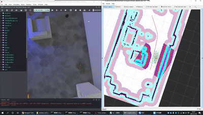
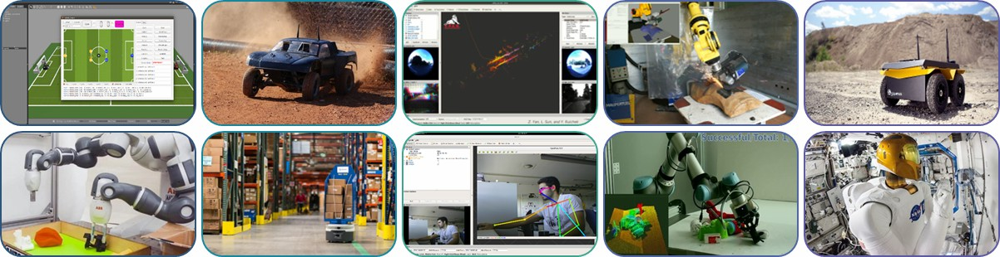
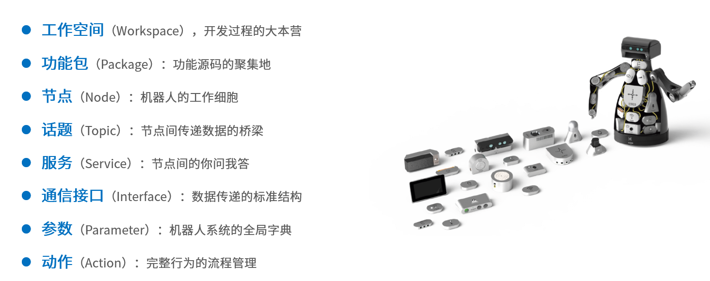

# 导读：ROS2入门
## 目录
- [导读：ROS2入门](#导读ros2入门)
  - [目录](#目录)
  - [1.为什么要学习ROS2？](#1为什么要学习ros2)
  - [ROS2的特点](#ros2的特点)
  - [概念总览](#概念总览)

## 1.为什么要学习ROS2？

假如你想要在一台小车上实现导航、避障，你需要什么知识？

ROS没有出现之前，这是非常复杂的一件事情，因为一个机器人需要涉及到多个部分，而且这些部分之间还要进行**情报交流**。

例如设计一个像下图一样的轮式移动机器人，我们对其进行拆解。可以分为**感知、决策、控制**三个部分。 

- **感知部分**有：激光雷达、深度相机、IMU、里程计、碰撞感知、建图
- **决策部分**有：路径规划（navigation）算法、定位算法
- **控制部分**有：轮子驱动

如果想要整个机器人可以跑起来，那么必须要让他们互相交流，把雷达感知部分的数据发给决策部分，把决策部分的指令发给控制部分，ROS就是为了实现这一点。

  
**ROS的作用就像我们的身体的神经系统一样，通过神经系统将我们身体的各个部分接入大脑。**

## ROS2的特点
1. **提高机器人软件复用率**
提高机器人软件复用率，这个目标简单来讲就是**不要重新造轮子**。
ROS怀揣“**提高机器人软件复用率**”的目标，促使社区快速发展和繁荣，时至今日，ROS已经广泛用于各种机器人的开发，无论是机械臂、移动机器人、水下机器人，还是人形机器人、复合机器人，统统都可以看到ROS的身影，ROS已经成为机器人领域的普遍标准。

2. **通信机制**
其中一个比较重要的特点是通信机制对于机器人运动的各种场景，ROS2提供了丰富的通信机制，例如：
- 话题（Topic）：一种消息传递机制，用于一对多的发布/订阅模式。
- 服务（Service）：一种请求/响应模式，用于一对一的通信。
- 动作（Action）：一种更复杂的通信机制，用于实现任务的分解和执行。
没有接触过ROS2的同学可能对此没有太多感触，因此我们具体遇到的时候再详细介绍。
3. **庞大的社区**
ROS2拥有庞大的社区，这意味着你可以轻松地找到大量的资源和支持，无论是文档、教程、示例代码还是开源项目，ROS2的社区都能为你提供帮助。

## 概念总览
在接下来的教程中，我们会逐渐学习到这些内容：
