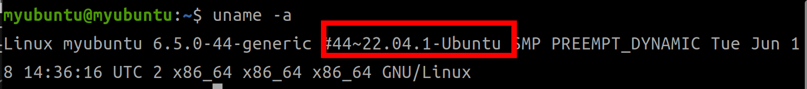
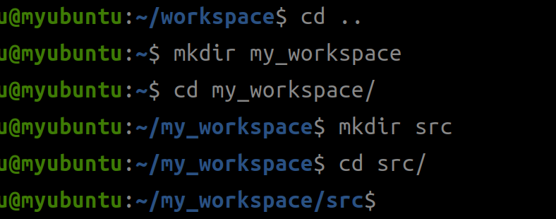
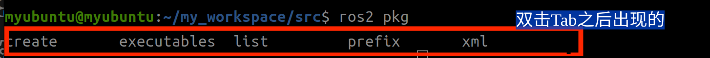
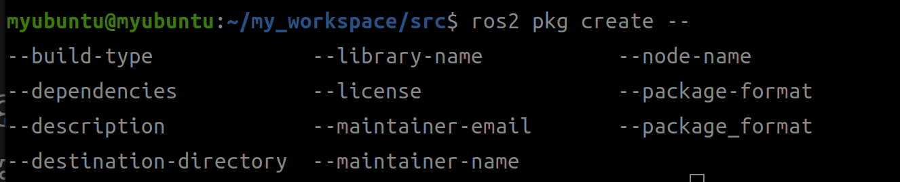
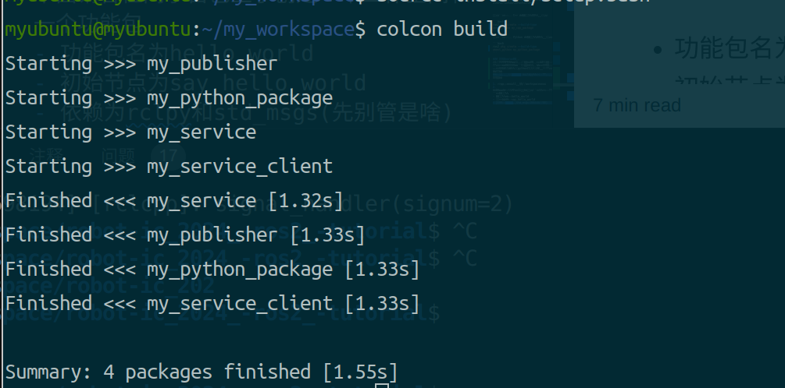
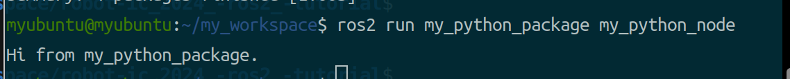

## 目录
- [目录](#目录)
- [提醒：](#提醒)
- [工作空间、功能包、节点是什么？](#工作空间功能包节点是什么)
- [创建工作空间、功能包、节点](#创建工作空间功能包节点)
  - [创建工作空间](#创建工作空间)
  - [创建功能包](#创建功能包)
  - [编译](#编译)
  - [run运行](#run运行)

## 提醒：
在开始本节之前，请确保
1. 自己已经有一个可以正常使用的**Ubuntu22.04**系统
2. 安装好了**ROS2 humble**(没有的话请参照之前的教程进行安装)
3. 已经掌握了Linux的一些常用命令，如`mkdir、cd、ls`

PS:可以输入`uname -a`查看是否为ubuntu22.04，输入`printenv ROS_DISTRO`查看当前ROS版本


## 工作空间、功能包、节点是什么？
见下图：


这跟文件夹就是一回事：
- **主文件夹**对应**工作空间**
- **桌面、下载、图片**这些对应**功能包**
- **桌面下的文件、图片文件夹下的图片**对应**节点**
一个工作空间下可以有多个功能包，一个功能包可以有多个节点存在，例如：
.svg)

光听无用，下面我带大家依次创建工作空间、功能包。

## 创建工作空间、功能包、节点
### 创建工作空间
1. 在一个合适的地方，创建workspace,名字任取，但要自己和别人看得懂



2. 在这个workspace下创建一个src文件夹，这里存放所有功能包的源代码。

<details>
<summary>为什么要创建src？</summary>

<pre><code>

1. **代码组织**：
   `src` 文件夹是用来存放所有 ROS2 包的地方。通过将代码集中放在 `src` 中，工作空间的结构变得更加清晰，可以让开发者轻松找到和管理各个包。

2. **方便构建工具使用**：
   ROS2 使用 `colcon` 来进行构建，`colcon` 默认会查找工作空间中的 `src` 目录来找到所有的 ROS2 包。通过将 ROS2 包放在 `src` 中，可以让 `colcon` 自动检测并构建这些包，而不需要手动指定路径。

3. **保持标准的工作空间结构**：
   ROS2 工作空间有一个标准化的目录结构，通常如下：
   ```
   workspace/
   ├── log/
   ├── build/
   ├── install/
   └── src/
   ```
   - `log/`：日志
   - `src/`：存放源代码的包
   - `build/`：`colcon` 构建过程中生成的中间文件
   - `install/`：编译后生成的可执行文件和依赖文件
   
   这种结构不仅便于开发，还便于团队协作和部署
   在比赛的小电脑上面我们会有一个大的工作空间，每个人负责一个或多个不同的包
</code></pre>
</details>


### 创建功能包
在创建功能包前，请确保当前目录**在src文件夹下**。
在 ROS2 中创建功能包的命令格式可以表示为：

```bash
$ ros2 pkg create --build-type <build-type> <package_name>
```

其中，`ros2` 命令的各个部分解释如下：

- **`pkg`**：表示与**功能包**相关的操作。
- **`create`**：表示创建一个新的功能包。
- **`--build-type`**：指定功能包的构建类型。
  - 如果是 **C++** 或 **C**，则使用 `ament_cmake`。
  - 如果是 **Python**，则使用 `ament_python`。
- **`<package_name>`**：要创建的功能包的名称。


<span style="font-size:20px; color:red;">
上面这些东西都别去死记硬背！双击Tab可以自动补全，查看可选项！
</span>  

<del> 想当年我高考作文一点都不会写，还好我学过Linux，按了几下tab linux直接帮我补全全文了 </del>



在create这里双击tab会出现许多配置，我们挑其中比较重要的几个来讲讲


- **`--build-type`**：设置功能包的构建类型（C++/Python）,默认为C++。
- **`--node-name`**：为包中默认节点命名。初始化功能包的时候会有个默认节点，你可以在这里就给它命名。
- **`--dependencies`**：指定包的依赖项。（暂时c++选择依赖rclcpp，python依赖rclpy）依赖项除了在这里添加，也可以修改配置文件在创建后添加。
- **`--description`**：为包添加描述信息。


ros2 pkg还有很多功能，感兴趣的同学可以[自行查阅](https://fishros.com/d2lros2/#/humble/chapt2/get_started/2.ROS2%E5%8A%9F%E8%83%BD%E5%8C%85%E4%B8%8E%E5%B7%A5%E4%BD%9C%E7%A9%BA%E9%97%B4?id=_2%e5%8a%9f%e8%83%bd%e5%8c%85%e6%98%af%e4%bb%80%e4%b9%88)


创建一个基于 C++ 的功能包可以使用：

```bash
ros2 pkg create my_cpp_package --build-type ament_cmake --node-name my_cpp_node
```

创建一个基于 Python 的功能包可以使用：

```bash
ros2 pkg create my_python_package  --build-type ament_python --node-name my_python_node
```

### 编译
只是编写源代码我们是无法运行它的，因为计算机看不懂高级语言，需要我们将其编译为二进制文件，或者用python解释器来使计算机理解。
这里我们使用colcon build对工作空间进行编译。

1. **回到主目录**，也就是workspace目录
2. 运行命令`colcon build`，这是ros官方的编译工具
   可以使用命令`colcon build help`查看可以带的参数，这里讲几个比较常用的
   1. `colcon build --cmake-args -DCMAKE_BUILD_TYPE=Debug`
   2. --packages-select <package_name> 只编译指定的功能包
   3. --parallel-workers <number> 设定并行数（当包数量太多时防止卡死）
   4. --symlink-install 创建符号链接而不是复制文件（无需每次修改后编译）
3. source当前目录(workspace)下的install/setup.bash。`source install/setup.bash`
> 为什么要这么做？source命令的主要作用是**确保你的终端能够正确地找到ROS工作空间中的程序、库和资源**。具体来说，source之后会设置相关的环境变量，使得终端能够识别和定位ROS的包、节点和消息等。


<span style="font-size:20px; color:red;">
注意!
<p></p>
1. source命令只对当前终端有效，如果你关闭终端，那么这些环境变量就会失效。因此，每次打开新的终端时，都需要重新执行source命令。
</span>  
<p></p>
<span style="font-size:20px; color:red;">
2. 只要对源代码进行过修改，就需要重新编译、source。
</span>  


### run运行
如果在创建功能包时使用了配置 `--node-name 节点名`，则 ROS 会自动生成一个默认节点。此时，可以使用以下命令来运行该节点：

``` bash
ros2 run my_python_package my_python_node
```



<span style="font-size:20px; color:blue;">
下面请各位同学自己上手创建一个工作空间和一个功能包：

- 功能包名为hello_world
- 初始节点为say_hello_world 
- 依赖为rclpy和std_msgs

并运行这个功能包下的节点，输出hello world
</span>  