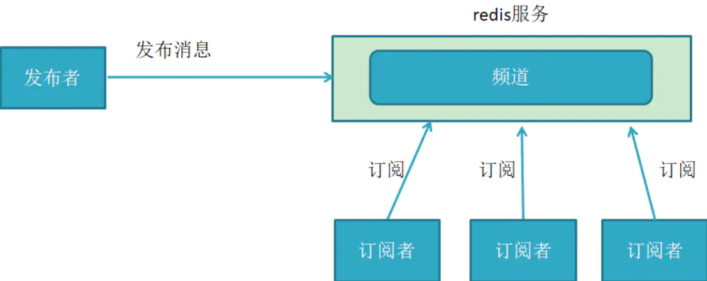

## 目录
- [目录](#目录)
- [发布者、订阅者是什么？](#发布者订阅者是什么)
- [体验发布、订阅](#体验发布订阅)
  - [运行发布者节点](#运行发布者节点)
  - [运行订阅者节点](#运行订阅者节点)
- [RQT认识与基本使用](#rqt认识与基本使用)
  - [RQT是什么](#rqt是什么)
  - [RQT安装](#rqt安装)
  - [RQT使用](#rqt使用)
    - [Topic Monitor（查看话题）](#topic-monitor查看话题)
    - [Message Publisher（发布话题）](#message-publisher发布话题)
- [编写发布者节点](#编写发布者节点)
  - [我们的目标](#我们的目标)
  - [编写发布者节点-Python](#编写发布者节点-python)
    - [python运行](#python运行)
    - [RQT-log console](#rqt-log-console)
    - [run运行](#run运行)
  - [从g++到cmake：源码是如何一步步变成可执行文件的](#从g到cmake源码是如何一步步变成可执行文件的)
    - [什么是编译器](#什么是编译器)
    - [什么是Makefile](#什么是makefile)
    - [什么是CMake？为什么要用CMake](#什么是cmake为什么要用cmake)
  - [编写发布者节点-CPP](#编写发布者节点-cpp)
- [编写订阅者节点](#编写订阅者节点)
  - [编写订阅者节点-Python](#编写订阅者节点-python)
  - [编写订阅者节点-CPP](#编写订阅者节点-cpp)
    - [一些经验](#一些经验)

## 发布者、订阅者是什么？
- 发送数据的对象称之为**发布者**
- 接收数据的对象称之为**订阅者**
- 每一个话题都需要有一个**名字**，叫做**话题**，传输的数据也需要有固定的数据类型。


打一个比方，比如有一个公众号，它的名字叫做`华南理工大学`
这个`华南理工大学`就是**话题名称**

公众号的**发布者**是该文章的作者，他会把组织好的内容排版成要求格式的公众号文章，发布出去。

这个**文章格式**，就是话题的**数据类型**。

如果大家对这个话题感兴趣，就可以**订阅**`华南理工大学`，成为**订阅者**之后自然就可以收到`华南理工大学`的公众号文章，没有订阅的话，也就无法收到。

在ros中，每个话题名称都是开发者自己设置，发布者和订阅者在节点内创建，ros就是用这种方式实现各个部分的通讯

## 体验发布、订阅
先介绍下ros2运行节点的一种方法：
```
ros2 run 包名字 可执行文件名字
```
### 运行发布者节点

这是ROS官方为你写好的一个用来学习ROS的功能包，正常情况下是自带的，不需要额外下载：
```bash
ros2 run examples_rclcpp_minimal_publisher  publisher_member_function
```
> 突击检查：它的包名和节点名分别是什么？


需要注意的是，此时显示的helloworld**并不是**订阅者接收到的真实的消息，而是**Debug日志** 这是给我们开发者看的消息。发布者的消息，要靠节点的接受者**订阅**

### 运行订阅者节点
保持刚才的发布者运行，**重新开启一个终端**，输入
```bash
ros2 run  examples_rclpy_minimal_subscriber subscriber_member_function
```

可以看到该节点**接收**到了发布者的信息，**解析**后输出日志：`I heard xxxx`
## RQT认识与基本使用
在手动编写节点之前，我们先认识一个很好用、很方便、很nb的可视化工具：RQT。
### RQT是什么
RQT是一个GUI框架，通过插件的方式实现了各种各样的界面工具，实现对ROS的各种可视化。
### RQT安装
如果根据鱼香ROS的教程进行安装，默认是带有RQT工具的，如果发现自己没有安装，或者插件不完全，可以使用下面的命令安装：
``` bash
sudo apt install ros-humble-rqt-*
```
该命令直接把rqt的所有工具都安装了，你也可以根据需求安装
### RQT使用
终端输入rqt打开界面

第一次打开可能界面是空白的，因为玄机都藏在Plugins里面。

里面有很多种插件，我们会在课程中遇到的时候穿插RQT的插件使用方法教学。
#### Topic Monitor（查看话题）
现在我们用它来查看一下话题：
首先，关掉之前的窗口，再次运行发布者
```bash
ros2 run examples_rclcpp_minimal_publisher  publisher_member_function
```
并在另一个终端输入rqt，找到Plugins-Topics-Topic Monitor

parameter_events 和rosout是默认的，不用管他
剩下的就是**正在发布**的**话题**了
我们将该话题打上勾，并且展开，就可以看到publisher发布的话题内容


需要注意的是，rqt的Topic Monitor有很高的延迟
所以查看话题时，我们会使用命令行工具：
``` bash
ros2 topic echo 话题名称
```
在此处是“ros2 topic echo /topic”（如果你不知道话题名字，别忘了双击tab找），**前面带有“/”的就是话题**


#### Message Publisher（发布话题）
该插件允许我们方便地手动发布话题，以测试订阅逻辑。
1. 首先，关闭所有publisher节点
2. 运行订阅者，订阅/topic话题。
```bash
ros2 run examples_rclcpp_minimal_subscriber subscriber_member_function
```

3. 在另一个终端输入rqt，找到Plugins-Topics-Message Publisher
> 点击左上角刷新按键可以刷新


在Topic处，我们可以看到正在发布的话题或者是等待被发布的话题（有订阅者订阅了这个话题，但不一定被发布了）
4. 这里我们选中/topic ，也就是`examples_rclcpp_minimal_subscriber`订阅的话题，点击右侧+号，展开并修改expression
5. 将该话题左侧的白色框框勾选上，代表发布这个话题。


这时，一个话题就被我们手动发布了。

rqt还要诸多神奇妙用，日后你自会明白（不是）

<span style="font-size:20px; color:blue;">
现在请你动手实践

1. 运行小乌龟节点`ros2 run turtlesim turtlesimnode`
2. 运行小乌龟键盘控制节点 `ros2 run turtlesim turtle_teltop_keyboard`
3. 使用命令行或者rqt，查看`键盘控制节点`发布的话题：cmd_vel的具体内容

</span>  

## 编写发布者节点

现在我们正式开始用代码自己编写一个发布者节点。
### 我们的目标
编写一个Python/CPP节点，能够**定时**发布指定**数据类型**话题
### 编写发布者节点-Python
我们将使用面向对象的思想进行编写。
1. 首先，**确保你已经使用ros2 pkg create创建了一个包**
```bash
ros2 pkg create my_publisher --build-type ament_python
```

可以看到如上目录结构。我们统一在`src/包名/包名`下面（也就是上图的__init__.py同一目录）存放源代码。

2. 在`workspace/包名/包名`下新建一个py文件，**这里的python文件名就是你的节点名**
```bash
touch my_pub_member_function.py
```
3. 编写发布者


完整代码如下：
``` python

import rclpy                                     # ROS2 Python接口库
from rclpy.node import Node                      # ROS2 节点类
from std_msgs.msg import String                  # 字符串消息类型
'''
String是一种基本的消息类型。跟C++有`int double float`一样，ROS也有一套自己的消息类型，比如`String Int64 Float64`等.
'''

class MinimalPublisher(Node):

    def __init__(self):
        super().__init__('minimal_publisher') # ROS2节点父类初始化
        self.publisher_ = self.create_publisher (String, 'topic',10) # 创建发布者对象（消息类型、话题名、队列长度）
        timer_period = 1  # seconds
        self.timer = self.create_timer(timer_period, self.timer_callback) # 创建一个定时器（单位为秒的周期，定时执行的回调函数）
        self.i = 5

    def timer_callback(self):
        msg = String() # 创建一个String类型的消息对象
        if self.i % 2 == 1:
            content=f"{self.i}条悟：你才是挑战者"
        else:
            content=f"{(self.i-1)/2}条悟：很抱歉没能让宿傩大人使出全力"
            
        msg.data = '第%d话： %s' % (230+self.i, content) # 填充消息对象中的消息数据
        
        self.publisher_.publish(msg) # 发布话题消息
        self.get_logger().info('Publishing: "%s"' % msg.data) # 输出日志信息，有(info warn error fatal)等不同级别。跟你调试代码的时候print变量一样
        self.i += 1

def main(args=None): # ROS2节点主入口main函数

    rclpy.init(args=args) # ROS2 Python接口初始化
    minimal_publisher = MinimalPublisher() # 创建ROS2节点对象并进行初始化
    rclpy.spin(minimal_publisher) # 循环等待ROS2退出，单步调试到这里的时候会将程序交给ROS接管，会进入死循环
    

if __name__ == '__main__':
    main() # 运行main（）
```
值得一提的是，使用get_logger().info|warning|error 打印可以更方便地管理和分类日志信息，[后面会提到](#rqt-log-console)

> **PS:不记得要什么参数的时候，鼠标悬停在该函数名上就可以显示提示**


我们在编写完成之后，**需要将所用到的ROS库(rclpy std_msgs)添加在Package.xml里面，尽管它对你编译、运行不起任何作用。**
编写 `package.xml`文件的主要意义在于，它能够使 ROS 清晰地识别你项目所依赖的库和包。通过在 package.xml 中明确声明依赖项，ROS 工具链可以解析这些依赖，并确保在构建或运行时，所有必要的依赖库都已正确安装。
这为其他开发者使用你的代码提供了极大的便利性，他们可以通过**rosdep**工具一键自动安装所需的依赖，而无需手动查找和安装每个依赖包。
```
<depend>rclpy</depend>
<depend>std_msgs</depend>
```

#### python运行
由于Python是解释运行的，事实上我们并不需要进行编译操作，直接`python 源文件.py`就可以运行，这也是Python的方便之处。

vscode里面也一样

#### RQT-log console
保持该发布者运行，打开rqt，找到插件logging-console

这里可以看到之前用self.get_logger().info()输出的内容

#### run运行
尽管使用 Python 直接运行 ROS 节点非常方便，但在编写工程代码时，我们通常不会采用这种方式运行。主要原因如下：

1. **构建与管理复杂项目**：
   如果你的ROS2项目包含多个包或组件，`colcon build` 能够自动管理所有包之间的依赖关系和构建过程。

2. **跨语言支持**：
   如果你的项目未来需要扩展，加入C++或其他语言的支持，`colcon build` 是构建这些混合语言项目的标准工具。
因此这里我们再介绍一种方法：Run运行
1. 找到`setup.py`,添加程序入点
```python
entry_points={
        'console_scripts': [
            'my_pub_member_function  = my_publisher.my_pub_member_function:main',
        ],
    },

```
在`console_scripts`中添加一句命令
**`'<节点名>=<py文件所在文件夹名>.<节点名>：<入口函数名>'`**
<font size="1">
OS：这太不优雅了（
好的框架不应该给程序员增加记忆上的负担（
~~要是有佬能找个插件自动生成入点就好了~~
</font>
1. 编译并source
参见前文
ps:要是有同学觉得每次都要source很麻烦，可以在~/.bashrc 末尾添加  
`source ..../workspace/install/setup.bash`,但不是很推荐
1. run运行
`ros2 run my_publisher my_pub_member_function`


### 从g++到cmake：源码是如何一步步变成可执行文件的
<details>
<summary>这一部分内容从底层分析了我们写的高级程序语言是如何转换为机器可以阅读的机器码的，对理解后面使用C++编程大有帮助。</summary>


#### 什么是编译器
我们平时所说的程序，是指双击后就可以直接运行的程序，这样的程序被称为可执行程序（Executable Program）。在 Windows 下，可执行程序的后缀有 .exe 和 .com（其中 .exe 比较常见）；在类 UNIX 系统（Linux、Mac OS 等）下，可执行程序没有特定的后缀，系统根据文件的头部信息来判断是否是可执行程序。

可执行程序的内部是一系列计算机指令和数据的集合，它们**都是二进制形式的**，CPU 可以直接识别，毫无障碍；但是对于程序员，它们非常晦涩，难以记忆和使用。

例如，在屏幕上输出“VIP会员”，C语言的写法为：
```c
printf("VIP会员");
```
二进制的写法为：

你感受一下，直接使用二进制是不是想撞墙，是不是受到一吨重的伤害？
在计算机发展的初期，程序员就是使用这样的二进制指令来编写程序的，那个拓荒的年代还没有编程语言。

直接使用二进制指令编程对程序员来说简直是噩梦，尤其是当程序比较大的时候，不但编写麻烦，需要频繁查询指令手册，而且除错会异常苦恼，要直接面对一堆二进制数据，让人眼花缭乱。另外，用二进制指令编程步骤繁琐，要考虑各种边界情况和底层问题，开发效率十分低下。

这就倒逼程序员开发出了编程语言，提高自己的生产力，例如汇编、C语言、C++、Java、Python、Go语言等，都是在逐步提高开发效率。至此，编程终于不再是只有极客能做的事情了，不了解计算机的读者经过一定的训练也可以编写出有模有样的程序。

C语言代码由固定的词汇按照固定的格式组织起来，简单直观，程序员容易识别和理解，但是对于CPU，C语言代码就是天书，根本不认识，CPU只认识几百个二进制形式的指令。这就需要一个工具，**将C语言代码转换成CPU能够识别的二进制指令**，也就是将代码加工成 .exe 程序；这个工具是一个特殊的软件，叫做编译器（Compiler）。

编译器能够识别代码中的词汇、句子以及各种特定的格式，并将他们转换成计算机能够识别的二进制形式，这个过程称为**编译（Compile）**。
对于C语言，Linux 下常用的是 GUN 组织开发的 GCC，很多 Linux 发行版都自带 GCC；
而对于C++，Linux 下常用的是 GUN 组织开发的 G++。
下面我们通过一个简单的例子了解g++的使用流程。
1. 编写一个cpp文件
新建一个Helloworld.cpp文件，内容如下：
```cpp
#include <iostream>
using namespace std;
int main()
{
    cout << "Hello World!" << endl;
    return 0;
}
```
2. 编译
在终端中输入以下命令：
`g++ Helloworld.cpp -g -o Helloworld`
其中：
- g++是编译器，用于将C++代码编译成可执行程序；
- Helloworld.cpp是源代码文件；
- -g 是编译选项，用于生成调试信息，使得我们可以用gdb等调试工具进行调试；
- -o Helloworld是编译选项，用于指定生成的可执行程序的名字，如果不指定，默认为a.out。
3. 运行

此时我们已经生成了一个可执行程序Helloworld。里边的内容已经是二进制形式了，CPU可以直接识别，但程序员无法直接阅读。
使用命令`./Helloworld`即可直接运行该程序，输出`Hello World!`。
由此我们也可以看出，和python的解释型语言不不同，C++是编译型语言，需要先编译成可执行程序才能运行。因此**只要修改了源代码，就需要重新编译。**
4. 调试
调试是定位软件瑕疵的最直接和最有效的方法 。没有哪个程序员能一下子写出没有错误的代码。这里我们简单介绍一下gdb调试工具的使用。
由于我们刚才使用了-g选项，所以我们可以使用gdb工具进行调试。
使用命令`gdb 可执行文件名`进入gdb调试环境.
gdb常用语法如下：
r（run）：运行程序
n（next）：单步执行
s（step）：进入函数内部
q（quit）：退出gdb
b（break）：设置断点
c（continue）：继续运行程序
p（print）：打印变量的值
x（examine）：查看内存中的内容
l（list）：查看源代码
下面是一个简单的例子：
```bash
gdb ./Helloworld
b 1 
r
```
- `gdb ./Helloworld`：进入gdb调试环境
- `b 1`：设置断点，在第一行设置断点
- `r`：运行程序


可以看到程序在第一行停了下来.
更多用法请自行探索，这里只是简单介绍一下。


#### 什么是Makefile
以 Linux 下的 C 语言开发为例来具体说明一下，多文件编译生成一个文件，编译的命令如下所示：
```
g++ -o outfile name1.cpp name2.cpp ...
```
outfile 要生成的可执行程序的名字，nameN.c 是源文件的名字。这是我们在 Linux 下使用 g++ 编译器编译 CPP 文件的例子。如果我们遇到的源文件的数量不是很多的话，可以选择这样的编译方式。如果源文件非常的多的话，就会遇到下面的这些问题：
- name1.cpp 用到了数学计算库 math 中的函数，我们得手动添加参数 -lm；
- name4.cpp 用到了小型数据库 SQLite 中的函数，我们得手动添加参数 -lsqlite3；
- name5.cpp 使用到了线程，我们需要去手动添加参数 -lpthread；

因为有很多的文件，还要去链接很多的第三方库。所以在编译的时候命令会很长，并且在编译的时候我们可能会涉及到文件链接的顺序问题，所以手动编译会很麻烦。

如果我们学会使用 Makefile 就不一样了，它会彻底简化编译的操作。把要链接的库文件放在 Makefile 中，制定相应的规则和对应的链接顺序。这样只需要执行 make 命令，工程就会自动编译，省略掉手动编译中的参数选项和命令，非常的方便。
下面是一个简单的Makefile的例子：
在刚才的文件夹下，新建一个文件，名为Makefile（名字必须一模一样），内容如下：
```makefile
all:
    g++ hello_world.cpp -g -o Helloworld
```
然后再在终端中输入`make`命令，即可自动编译生成可执行程序Helloworld。

效果和之前手动编译是一样的。
#### 什么是CMake？为什么要用CMake
CMake是一个跨平台的安装（编译）工具，可以用简单的语句来描述所有平台的安装(编译过程)。他能够输出各种各样的makefile或者project文件。
简单来说，就是Makefile
1. 太难写了
2. **只能在linux平台上使用**
非常不方便。cmake用更为高级的语法对构建过程进行了封装，使得我们能够更加方便地编写构建过程，并且可以跨平台使用。
ROS2的项目一般使用CMake进行构建，使得当我们需要某个包的时候，直接调用find_package就可以了，而不需要手动对每一个文件进行链接。

下面是一个简单的CMake的例子:
1. 在刚才的文件夹下，新建一个文件，名为CMakeLists.txt（名字必须一模一样），内容如下：
```cmake
cmake_minimum_required(VERSION 3.10)

# 定义项目名称
project(Helloworld)

# 设置编译选项，启用调试信息
set(CMAKE_CXX_FLAGS "${CMAKE_CXX_FLAGS} -g")

# 添加可执行文件
add_executable(Helloworld hello_world.cpp)
```
- project：定义项目名称
- set：设置编译选项，启用调试信息
- add_executable：添加可执行文件
- 之后还会遇到find_package(寻找外部库)、target_link_libraries（链接库）等命令，遇到的时候再解释。
2. 输入如下命令:
```bash
mkdir build
cd build
cmake ..
make
```
- `mkdir build`:新建一个build文件夹，用于存放编译生成的文件
- `cd build`: 进入build文件夹
- `cmake ..`: **生成Makefile文件**，..表示上一级目录
- `make`: 编译生成可执行程序


可以看到，我们不需要手动输入编译命令，只需要执行cmake和make命令，就可以自动编译生成可执行程序Helloworld。

</details>


### 编写发布者节点-CPP
**1. 创建功能包**
`ros2 pkg create my_publisher_cpp --node-name my_publisher_node --dependencies rclcpp --build-type ament_cmake`
- dependencies：程序运行依赖库，这里的rclcpp是ROS2的C++标准接口库
- node-name：默认节点名，推荐在创建包的时候配置，这样ROS会生成一个默认的节点并生成默认的配置，简化开发流程。
得到如下目录结构
```
my_publisher_cpp/
├── CMakeLists.txt
├── include
│   └── my_publisher_cpp
├── package.xml
└── src
    └── my_publisher_node.cpp

3 directories, 3 files

```
按照规范，统一在功能包下的src文件夹下编写源代码。
**2. 编写代码**
**my_publisher_node.cpp**
```cpp
#include <string> 
#include "rclcpp/rclcpp.hpp" //cpp的头文件
#include "std_msgs/msg/string.hpp" //string的头文件

class MinimalPublisher : public rclcpp::Node
{
public:
  MinimalPublisher()
  : Node("minimal_publisher"), count_(5)//初始化count为5
  {
    publisher_ = this->create_publisher<std_msgs::msg::String>("topic", 10);// 创建发布者
    timer_ = this->create_wall_timer(//创建定时器，500ms触发一次回调函数
      std::chrono::milliseconds(500), std::bind(&MinimalPublisher::timer_callback, this));
      /*使用std：：bind函数进行绑定，效果类似this->timer_callback*/
  }

private:
  void timer_callback()//回调函数
  {
    auto message = std_msgs::msg::String();
    std::string content;
    if (this->count_ % 2 == 1) {
      content = std::to_string(this->count_) + "条悟：你才是挑战者";
    } else {
      std::stringstream stream;
      stream << std::fixed << std::setprecision(1) << (this->count_ - 1) / 2.0;
      content = stream.str() + "条悟：很抱歉没能让宿傩大人使出全力";
    }
    message.data = "第" + std::to_string(count_+230) + "话： " + content;
    RCLCPP_INFO(this->get_logger(), "Publishing: '%s'", message.data.c_str());//输出日志
    publisher_->publish(message);//发布
    this->count_++;
  }
  rclcpp::TimerBase::SharedPtr timer_;//timer的指针
  rclcpp::Publisher<std_msgs::msg::String>::SharedPtr publisher_;//Publisher的指针
  size_t count_;
};

int main(int argc, char * argv[])
{
  rclcpp::init(argc, argv);//初始化
  rclcpp::spin(std::make_shared<MinimalPublisher>());//创建一个MinimalPublisher的智能指针，并spin
  return 0;
}
```

> ps：使用VSCode编辑时只要配置好了c_cpp_properties.json就会有高亮提示。

> 配置c_cpp_properties.json的方式是：
> ctrl-shift-p 搜c++:edit configurations 
> 
主要在包含路径这里，添加`/opt/ros/humble/include/**`，**递归**地从你的ros安装目录的include文件夹下找需要的头文件。
因此不要在这里添加具体的hpp或者h文件，否则反而会找不到。
> 

**3. 编译运行**
回到主目录，运行colcon build
如果你是一路跟着做过来的，那你应该会在这里报错：

看报错原因，是找不到std_msgs这个库。
这是因为**std_msgs并没有作为dependencies被include进来**。
回看刚才创建功能包的命令
```bash
ros2 pkg create my_publisher_cpp --node-name my_publisher_node --dependencies rclcpp --build-type ament_cmake
```
dependencies只添加了rclcpp，没有添加std_msgs.因此我们需要手动添加dependencies。
**3.1 手动添加依赖库**
找到当前功能包下的CMakeLists.txt,可以看到类似这样的代码：
```cmake
cmake_minimum_required(VERSION 3.8)
project(my_publisher_cpp)

if(CMAKE_COMPILER_IS_GNUCXX OR CMAKE_CXX_COMPILER_ID MATCHES "Clang")
  add_compile_options(-Wall -Wextra -Wpedantic)
endif()

# find dependencies
find_package(ament_cmake  REQUIRED)
find_package(rclcpp REQUIRED)

add_executable(my_publisher_node src/my_publisher_node.cpp)
target_include_directories(my_publisher_node PUBLIC
  $<BUILD_INTERFACE:${CMAKE_CURRENT_SOURCE_DIR}/include>
  $<INSTALL_INTERFACE:include>)
target_compile_features(my_publisher_node PUBLIC c_std_99 cxx_std_17)  # Require C99 and C++17
ament_target_dependencies(
  my_publisher_node
  "rclcpp"
)

install(TARGETS my_publisher_node
  DESTINATION lib/${PROJECT_NAME})

if(BUILD_TESTING)
  find_package(ament_lint_auto REQUIRED)
  # the following line skips the linter which checks for copyrights
  # comment the line when a copyright and license is added to all source files
  set(ament_cmake_copyright_FOUND TRUE)
  # the following line skips cpplint (only works in a git repo)
  # comment the line when this package is in a git repo and when
  # a copyright and license is added to all source files
  set(ament_cmake_cpplint_FOUND TRUE)
  ament_lint_auto_find_test_dependencies()
endif()

ament_package()

```

大部分配置在创建功能包的时候ROS都会替我们写好，我们只需要在此基础上修改即可。
几句关键命令：
```cmake


# 找到依赖包rclcpp
find_package(rclcpp REQUIRED)


# 生成可执行文件（可执行文件名 源文件）
add_executable(my_publisher_node src/my_publisher_node.cpp)

# 链接对应的包
ament_target_dependencies(
  my_publisher_node
  "rclcpp"
)

# 安装目标文件，使得source install/setup.bash的时候能够找到这个节点
install(TARGETS my_publisher_node
  DESTINATION lib/${PROJECT_NAME})

```
> 至于为什么要这么做，可以搜索：预处理、编译、汇编和链接

现在我们是缺少了std_msgs这个库，因此我们需要在 CMake 中配置正确的查找和链接步骤，以确保编译时能够找到并使用该库。
添加依赖完成后，部分CMakeLists如下：
```cmake
find_package(rclcpp REQUIRED)
find_package(std_msgs REQUIRED)#####################新增
add_executable(my_publisher_node src/my_publisher_node.cpp)
target_include_directories(my_publisher_node PUBLIC
  $<BUILD_INTERFACE:${CMAKE_CURRENT_SOURCE_DIR}/include>
  $<INSTALL_INTERFACE:include>)
target_compile_features(my_publisher_node PUBLIC c_std_99 cxx_std_17)  # Require C99 and C++17
ament_target_dependencies(
  my_publisher_node
  "rclcpp"
  "std_msgs"#####################新增
)

install(TARGETS my_publisher_node
  DESTINATION lib/${PROJECT_NAME})
```
**3.2 package.xml添加依赖库**
同Python，不再赘述
**3.3 编译运行**
修改完成后重新编译、source、运行

成功运行。

<span style="font-size:20px; color:blue;">
现在请你动手实践（cpp或python二选一）

1. 打开example_workspace中的功能包example_publisher（_cpp），找到代码源文件
2. 替换用注释块包围起来的内容，使其可以正常运行

</span>  

## 编写订阅者节点
### 编写订阅者节点-Python
订阅者的原理和发布者没啥区别，这里直接上代码，注意看看注释就行
```python
import rclpy
from rclpy.node import Node
from std_msgs.msg import String

class MinimalSubscriber(Node):

    def __init__(self):
        super().__init__('minimal_subscriber')
        self.subscription = self.create_subscription(
            String,   # 消息类型
            'topic',  # 话题名
            self.listener_callback, # 回调函数
            10) # 队列长度
        self.subscription  # prevent unused variable warning

    def listener_callback(self, msg):
        self.get_logger().info('I heard: "%s"' % msg.data)


def main(args=None):
        rclpy.init(args=args)
        minimal_subscriber = MinimalSubscriber()
        rclpy.spin(minimal_subscriber)


if __name__ == '__main__':
    main()
```

### 编写订阅者节点-CPP
```cpp
#include "rclcpp/rclcpp.hpp"
#include "std_msgs/msg/string.hpp"

using std::placeholders::_1;//声明一个占位符，用于绑定回调函数

class MinimalSubscriber : public rclcpp::Node//自定义一个类，继承自Node
{
public:
  MinimalSubscriber()
  : Node("minimal_subscriber")//设置节点名字
  {
    subscription_ = this->create_subscription<std_msgs::msg::String>(
      "topic", 10, std::bind(&MinimalSubscriber::topic_callback, this, _1));
  }
  /*创建一个订阅者，绑定回调函数。
    这里的10是队列长度，表示最多缓存10个消息
    * std::bind(&MinimalSubscriber::topic_callback, this, _1)
    等效于系统自动执行了这句命令：this->topic_callback(接收到的信息)；
    因为我们还不知道接收到的信息是什么，所以用占位符_1来占位
  */

private:
  void topic_callback(const std_msgs::msg::String & msg) const
  {
    RCLCPP_INFO(this->get_logger(), "I heard: '%s'", msg.data.c_str());
  }
  rclcpp::Subscription<std_msgs::msg::String>::SharedPtr subscription_;
};

int main(int argc, char * argv[])
{
  rclcpp::init(argc, argv);
  rclcpp::spin(std::make_shared<MinimalSubscriber>());
  rclcpp::shutdown();
  return 0;
}
```
运行结果如下


<span style="font-size:20px; color:blue;">
现在请你动手实践（只有python，cpp自己回去写，累了）

1. 打开example_workspace中的功能包example_subscriber，找到代码源文件
2. 替换用注释块包围起来的内容，使其可以正常运行

</span>  

#### 一些经验
如果你在build的时候遇到下图的情况

或者在run的时候**出现了已经被删掉的node的名字**
这种一般是环境变量的锅，可以使用colcon clean工具清除一下垃圾再跑。
1. 安装工具
`pip install colcon-clean`
1. 在workspace下运行`colcon clean workspace`即可。
2. 运行完成后**重新开一个终端**再build一次

****

